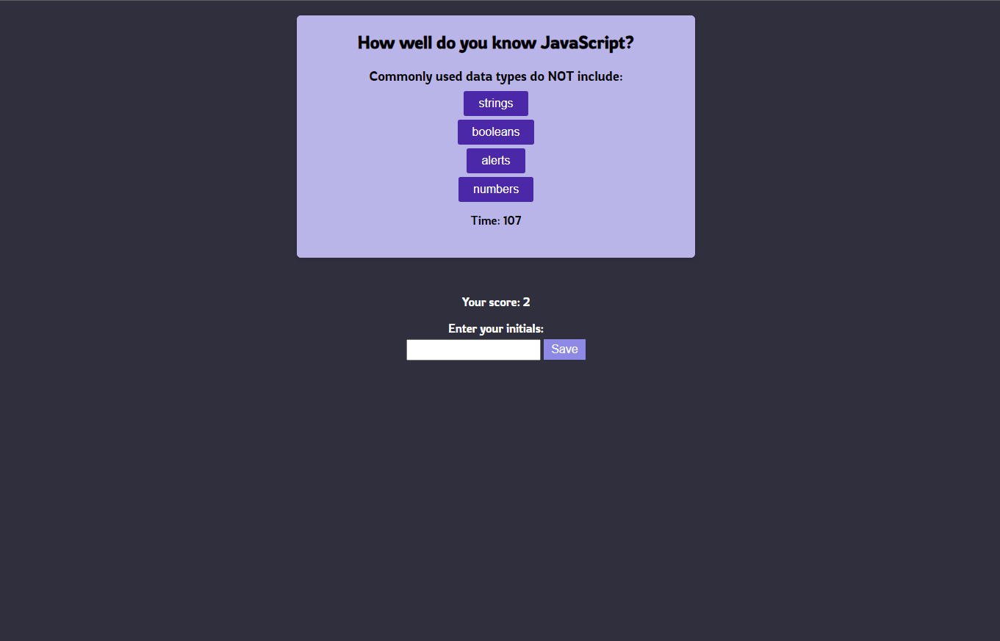

# code-quiz

## Description

The purpose of this application is to help bootcamp students test their knowledge of Javascript via an interactive quiz! 

## Usage

To use this web application, the user can interact with the webpage using the *start quiz* button which will trigger a 120sec timer and 5 questions about Javascript. Each time the user answers a question correctly, they are brought to the next question and a point is added to their score. If answered incorrectly, the time left on the timer will be reduced by 10 seconds. 
Once the quiz is finished, the user may log their score and initials into the console and is given the option to start the quiz again!

### link

[Link to deployed application](https://camparooni.github.io/code-quiz/)

### References Used 

* https://www.w3schools.com/js/js_htmldom_eventlistener.asp
* https://www.sitepoint.com/simple-javascript-quiz/
